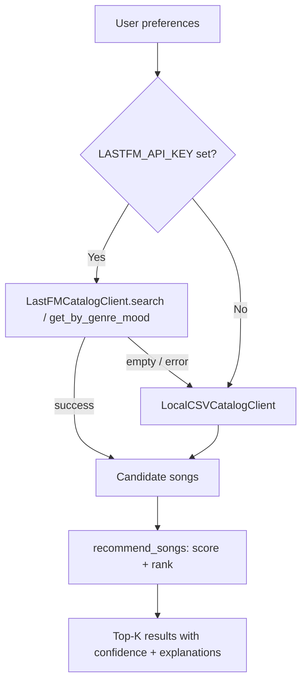

# 🎵 VibeFinder — Music Recommender

## Project Summary

A content-based music recommender with an **API-first catalog** (Last.fm) and an automatic **local CSV fallback**. It scores and ranks songs using a weighted formula across genre, mood, energy, and acousticness, then presents results through a Streamlit UI with confidence labels and per-recommendation explanations.

---

## Quick Start

### 1. Install dependencies

```bash
pip install -r requirements.txt
```

### 2. Configure your API key (optional but recommended)

The app works without a key — it uses the local CSV catalog (18 songs) as a fallback. For live Last.fm catalog search:

1. Get a free API key at https://www.last.fm/api/account/create (takes ~1 minute).
2. Copy `.env.example` to `.env`:
   ```bash
   cp .env.example .env
   ```
3. Edit `.env` and paste your key:
   ```
   LASTFM_API_KEY=your_actual_key_here
   ```
4. Load the variable before running:
   ```bash
   export $(cat .env | xargs)   # bash/zsh
   ```
   Or set it inline:
   ```bash
   LASTFM_API_KEY=your_key streamlit run src/app.py
   ```

### 3. Run the Streamlit app

```bash
streamlit run src/app.py
```

### 4. Run the CLI demo (original, unchanged)

```bash
python -m src.main
```

### 5. Run tests

```bash
pytest tests/
```

---

## Catalog & Fallback Behavior

| Condition | Catalog used | UI indicator |
|-----------|-------------|--------------|
| `LASTFM_API_KEY` set, API reachable | Last.fm live search | None (default) |
| Key set but API returns empty results | Local CSV (18 songs) | ℹ️ info banner |
| Key set but API is unreachable / errors | Local CSV (18 songs) | ⚠️ warning banner |
| `LASTFM_API_KEY` not set | Local CSV (18 songs) | ⚠️ fallback mode banner |

The app **never crashes** due to a missing or failing API — CSV fallback is always available.

---

## Architecture

```
src/
  catalog_client.py   — API + CSV catalog clients (BaseCatalogClient interface)
  recommender.py      — scoring, ranking, explanation logic (unchanged core)
  app.py              — Streamlit UI (API-first, CSV fallback)
  main.py             — original CLI demo (unchanged)

tests/
  test_recommender.py     — original OOP API tests + low-confidence scenario
  test_catalog_client.py  — API client, CSV client, fallback integration tests

data/
  songs.csv           — 18-song local catalog (fallback source)
```

### Data flow



---

## How Scoring Works

Each song receives a score out of 1.0:

| Signal | Weight | Details |
|--------|--------|---------|
| Genre match | 30% | Exact match on genre string |
| Mood match | 30% | Exact match on mood string |
| Energy proximity | 25% | `(1 - abs(song_energy - target)) * 0.25` |
| Acousticness fit | 15% | Raw acousticness if acoustic preferred, `1 - acousticness` if electronic, 0.5 if no preference |

Confidence labels: **High** ≥ 0.75 · **Medium** ≥ 0.50 · **Low** < 0.50

---

## Derived Audio Features (Last.fm limitation)

Last.fm does not expose Spotify-style audio analysis. When using the Last.fm client, the following fields are **derived from genre/mood tags** via lookup tables in `catalog_client.py`:

| Field | Derived from |
|-------|-------------|
| `energy` | Genre tag (e.g. metal → 0.95, ambient → 0.25) |
| `danceability` | Genre tag |
| `acousticness` | Genre tag |
| `tempo_bpm` | Genre tag |
| `valence` | Mood tag (e.g. happy → 0.85, sad → 0.30) |

To get real audio features, replace `LastFMCatalogClient` with a Spotify client using the [Audio Features endpoint](https://developer.spotify.com/documentation/web-api/reference/get-audio-features) — the `BaseCatalogClient` interface makes swapping trivial.

---

## User Profile Design

Four preference signals: `genre`, `mood`, `target_energy`, `likes_acoustic`.

Works well for distinguishing broad music styles (intense rock vs. chill lofi). Limitations: exact-match genre/mood favors common labels; 18-song CSV catalog has limited diversity; derived audio features are approximations.
